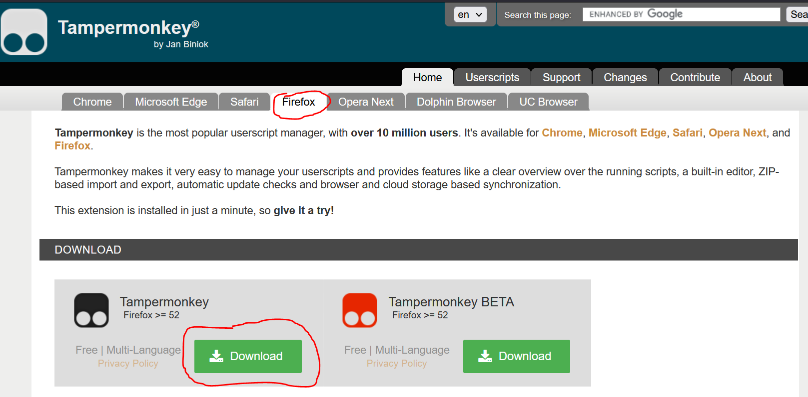

<!--
 Copyright (C) 2024 David Jones
 
 This program is free software: you can redistribute it and/or modify
 it under the terms of the GNU Affero General Public License as
 published by the Free Software Foundation, either version 3 of the
 License, or (at your option) any later version.
 
 This program is distributed in the hope that it will be useful,
 but WITHOUT ANY WARRANTY; without even the implied warranty of
 MERCHANTABILITY or FITNESS FOR A PARTICULAR PURPOSE.  See the
 GNU Affero General Public License for more details.
 
 You should have received a copy of the GNU Affero General Public License
 along with this program.  If not, see <https://www.gnu.org/licenses/>.
-->

# Install _CLJ_

The _Canvas Learning Journal_ (_CLJ_) tool is designed as a [browser userscript](https://en.wikipedia.org/wiki/Userscript) that each user must install.

!!! Note "About userscripts and userscript managers"

    Userscripts are small Javascript programs you install into your web browser. Once installed userscripts are designed to run when you view specific web pages (e.g. the people page of a Canvas course). A userscript will customise those specific web pages to better suit your purpose.

    To help manage userscripts you must first install a [userscript manager](https://en.wikipedia.org/wiki/Userscript_manager). 

Installing the _CLJ_ tool is a two-step process:

1. [Install the Tampermonkey browser extension](#install-tampermonkey).
2. [Install the _Canvas Learning Journal_ user script](#install-the-canvas-learning-journal-user-script).

## Install Tampermonkey

[TamperMonkey](https://www.tampermonkey.net/) is a widely used userscript manager. It can be used on most modern web browsers. 

### 1 - Visit the [Tampermonkey home page](https://www.tampermonkey.net/)

You should see instructions for downloading (installing) TamperMonkey for your web browser. e.g. the following image for the Firefox browser

<figure markdown>
<figcaption>Tampermonkey home page for Firefox</figcaption>
  
</figure>

### 2 - Click on the left-hand _Download_ button

As shown above, you can choose to download the stable (left-hand download button) version of TamperMonkey or the BETA (right-hand download button) version. The stable version is recommended.

You will be taken to your web brower's [extension or add-on service](https://en.wikipedia.org/wiki/Browser_extension).

### 3 - Follow the instructions to add Tampermonkey to your web browser

Each web browser’s browser extension installation process will be a little different. In general, it will provide you with details of what permissions the browser extension (Tampemonkey in this case) wishes to have and provides you with the option to install.

## Install the _Canvas Learning Journal_ user script

With TamperMonkey installed you can now 

<sl-button variant="success" size="small" href="https://github.com/djplaner/canvas-learning-journal/raw/main/dist/canvas-learning-journal.user.js">Install the <strong>Collections userscript</strong></sl-button>

    
If all is working you should something like the following image. An image showing TamperMonkey providing you with details of the userscript and asking if you wish to install (or perhaps update) it.
