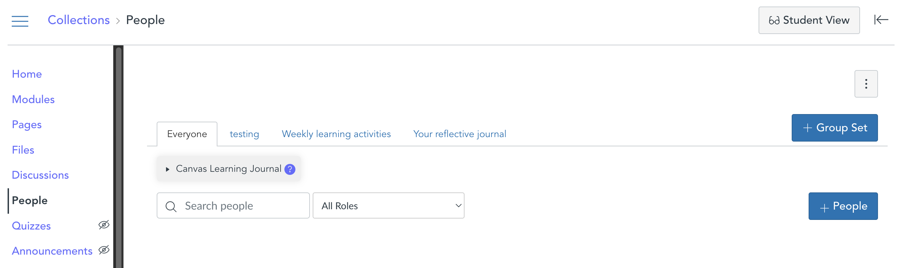
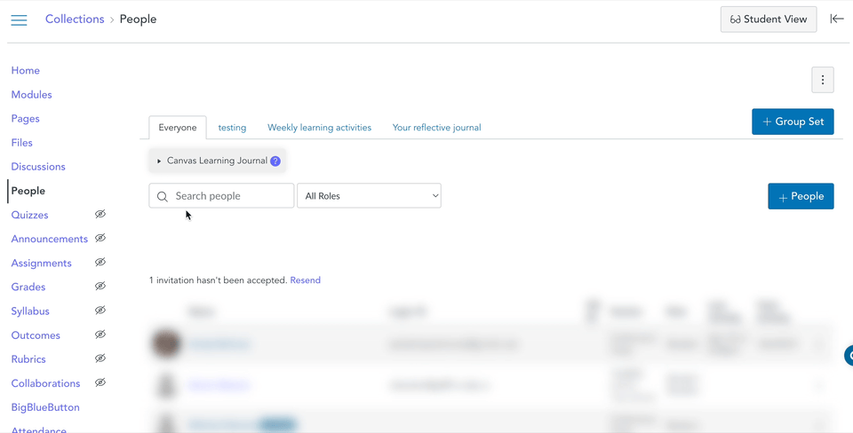

<!--
 Copyright (C) 2024 David Jones
 
 This program is free software: you can redistribute it and/or modify
 it under the terms of the GNU Affero General Public License as
 published by the Free Software Foundation, either version 3 of the
 License, or (at your option) any later version.
 
 This program is distributed in the hope that it will be useful,
 but WITHOUT ANY WARRANTY; without even the implied warranty of
 MERCHANTABILITY or FITNESS FOR A PARTICULAR PURPOSE.  See the
 GNU Affero General Public License for more details.
 
 You should have received a copy of the GNU Affero General Public License
 along with this program.  If not, see <https://www.gnu.org/licenses/>.
-->

# Use

Once you have [installed the _Canvas Learning Journal_ (_CLJ_) tool](./install.md) you use the tool by visiting [the People page](https://community.canvaslms.com/t5/Instructor-Guide/How-do-I-use-the-People-page-in-a-course-as-an-instructor/ta-p/667) of a Canvas course site.

!!! note "CLJ only works for people with a teacher role"

    CLJ provides functionality to help teachers design and management learning journal tasks using Canvas. Students engage in the learning journal task through standard Canvas tools.

## The _People_ page and the _Everyone_ tab

With CLJ installed, the People page will look like something like the following image. Take note of the gray _Canvas Learning Journal_ widget just under the _Everyone_ tab.

<figure markdown>

<figcaption>People page with the <em>CLJ</em> widget showing under the <em>Everyone</em> tab</figcaption>
</figure>

### Open the _CLJ_ tool

By default the CLJ tool is closed. You open it by clicking on the arrow icon located to the left of the title. Once open the tool will display information about any existing group sets within the course and provide a button to create a new learning journal task.

See the [_everyone_ reference page](../reference/software/everyone/index.md) for more detail on the functionality available from the People page.

<figure markdown>

<figcaption>Opening the <em>CLJ</em> tool</figcaption>
</figure>

## The group set tabs

Apart from the _Everyone_ tab, every other tab on the _People_ page provides information for a specific course [group set](https://community.canvaslms.com/t5/Instructor-Guide/How-do-I-create self-sign-up-groups-in-a-group-set/ta-p/667). In the _CLJ_ [conceptual model](../reference/conceptual/index.md), a properly configured group set becomes a learning journal task.

On a group set tab, the _CLJ_ widget displays information about the groupset and provides learning journal related functionality.

