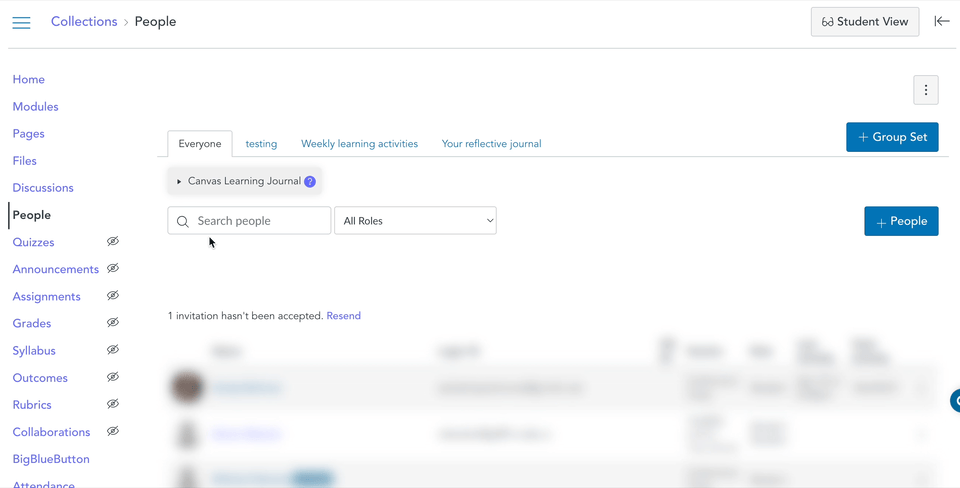

<!--
 Copyright (C) 2024 David Jones
 
 This program is free software: you can redistribute it and/or modify
 it under the terms of the GNU Affero General Public License as
 published by the Free Software Foundation, either version 3 of the
 License, or (at your option) any later version.
 
 This program is distributed in the hope that it will be useful,
 but WITHOUT ANY WARRANTY; without even the implied warranty of
 MERCHANTABILITY or FITNESS FOR A PARTICULAR PURPOSE.  See the
 GNU Affero General Public License for more details.
 
 You should have received a copy of the GNU Affero General Public License
 along with this program.  If not, see <https://www.gnu.org/licenses/>.
-->

# Everyone 

!!! warning "Early stages of development"

    This project is in the early stages of development. It is not yet ready for use.

[_Canvas Learning Journal_ (_CLJ_)](../../) helps instructors design and orchestrate learning journal activities. It is designed to run when instructors are accessing [the _People_ page](https://community.canvaslms.com/t5/Instructor-Guide/How-do-I-use-the-People-page-in-a-course-as-an-instructor/ta-p/667) in a Canvas course. The following explains the _CLJ_ functionality available when _CLJ_ is used when viewing the _Everyone_ tab (as shown in the following images).

<figure markdown>

<figcaption>People page with the <em>CLJ</em> widget showing under the <em>Everyone</em> tab</figcaption>
</figure>

## Open the _CLJ_ tool

Initially the _CLJ_ tool is closed. It can be opened by clicking on the arrow icon located to the left of the _CLJ_ title.

<figure markdown>

<figcaption>Opening the <em>CLJ</em> tool</figcaption>
</figure>

## Create a learning journal task

## Current groupsets

All help topics relevant to the CLJ as displayed on the People (everyone) tab.

- People title

    Page that gives a brief summary of the CLJ and points off to other parts of the site for more, including other parts of this page.

- Create a learning journal task

    Summary of the main functionality - creating a learning journal task. Explain how its just a group set configured a particular way. Though there are many different ways.

- Current group sets

    Table the gives overview of all the existing group sets

    An explanation of each column in the table.

